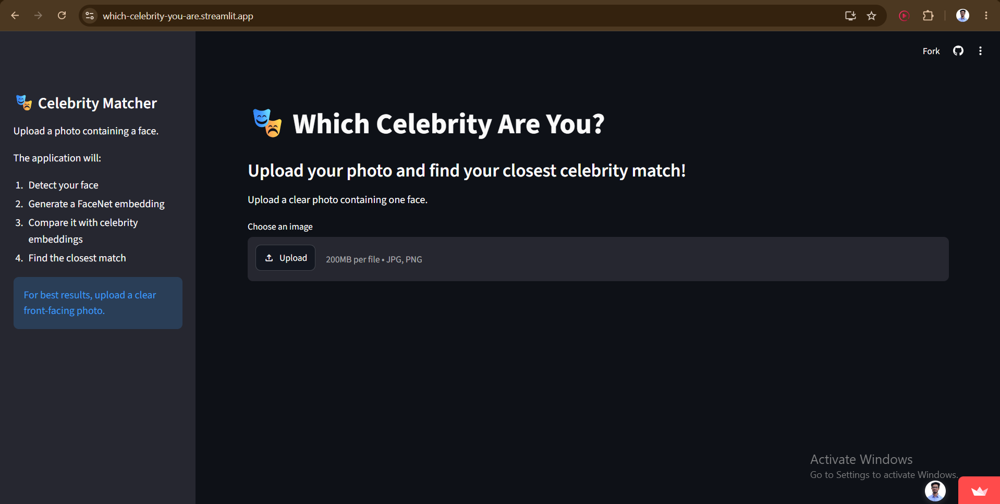
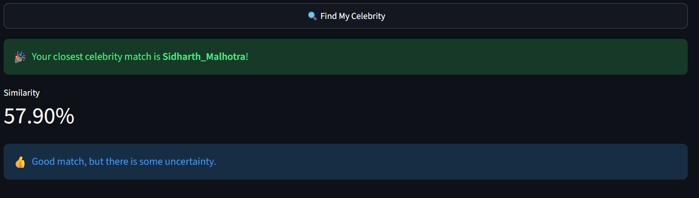

# 🎭 Dorpon - Which Celebrity Are You?

> An AI-powered face similarity application that identifies the celebrity a user most closely resembles based on facial features extracted from an uploaded image.

[](https://www.python.org/)
[](https://www.tensorflow.org/)
[](https://streamlit.io/)
[](https://opencv.org/)

---

## 🌐 Live Demo

🚀 **Try the application:**  
[https://which-celebrity-your-are.streamlit.app](https://which-celebrity-you-are.streamlit.app/)

Upload a photo, and the application detects the face, extracts facial features using FaceNet, and finds the most similar celebrity from the reference dataset.

---

## 🖥️ Application Preview






*Note: Replace the image paths above with your actual screenshots.*

---

## 📌 Project Overview

** Dorpon - Which Celebrity You Are?** is a computer vision application built using deep face embeddings and similarity search.

Instead of training a traditional image classification model, this project uses a **pre-trained FaceNet model** to convert faces into numerical feature vectors (embeddings). The uploaded face is then compared against a collection of celebrity face embeddings using **cosine similarity**.

### How it works

```text
User Uploads Image
        │
        ▼
Face Detection
     (MTCNN)
        │
        ▼
Face Cropping & Resizing
      160 × 160
        │
        ▼
FaceNet Embedding
      512-D Vector
        │
        ▼
Cosine Similarity
        │
        ▼
Find Most Similar Face
        │
        ▼
Celebrity Name + Image
```

---

## ✨ Key Features

- 📷 Upload JPG, JPEG, or PNG images
- 👤 Automatic face detection using MTCNN
- 🧠 Deep facial feature extraction using FaceNet
- 🔢 512-dimensional face embeddings
- 📐 Cosine similarity-based face matching
- 🖼️ Displays the closest celebrity match
- 📊 Shows similarity score
- ⚡ Fast inference using pre-computed celebrity embeddings
- ☁️ Deployed using Streamlit Community Cloud
- 📱 Simple and interactive web interface

---

## 🧠 Machine Learning Approach

### 1. Face Detection

The uploaded image is processed using **MTCNN** (Multi-task Cascaded Convolutional Networks).

MTCNN identifies the face region and provides its bounding box.

For images containing multiple faces, the application selects the largest detected face.

### 2. Face Preprocessing

The detected face is:

- Converted to RGB
- Cropped using the detected bounding box
- Resized to 160 × 160 pixels

This produces a standardized input for FaceNet.

### 3. Face Embedding

The processed face is passed through a pre-trained **FaceNet** model.

FaceNet converts each face into a **512-dimensional embedding vector** representing its facial characteristics.

Example:

```text
Input Face
    ↓
FaceNet
    ↓
[0.021, -0.184, 0.093, ..., 0.417]
        512 dimensions
```

The embedding is L2-normalized before similarity comparison.

### 4. Similarity Matching

The uploaded face embedding is compared with the stored celebrity embeddings using **cosine similarity**.

The similarity between two embeddings is calculated as:

```text
cosine_similarity(A, B) = (A · B) / (||A|| ||B||)
```

The celebrity image with the highest similarity score is selected as the final match.

---

## 🗂️ Dataset & Embeddings

The project uses a directory-based celebrity face dataset.

```text
data/
├── Celebrity_1/
│   ├── image_01.jpg
│   ├── image_02.jpg
│   └── ...
│
├── Celebrity_2/
│   ├── image_01.jpg
│   ├── image_02.jpg
│   └── ...
│
└── ...
```

Instead of generating embeddings every time a user uploads an image, the celebrity embeddings are generated beforehand and stored in:

```text
embedding.pkl
filenames.pkl
```

This significantly reduces inference time.

### Embedding generation

Each valid image goes through:

```text
Image
 ↓
MTCNN Face Detection
 ↓
Face Crop
 ↓
Resize 160×160
 ↓
FaceNet
 ↓
512-D Embedding
```

Only images where a face is successfully detected are included in the final embedding database.

---

## 🏗️ Project Structure

```text
Which_Celebrity_You_Are/
│
├── app.py
├── feature_extractor
├── generate_filename.py
├── test.py
│
├── embedding.pkl
├── filenames.pkl
│
├── requirements.txt
├── runtime.txt
├── .gitignore
├── README.md
│
├── assets/
│   ├── home.png
│   ├── result.png
│   └── prediction.png
│
└── data/
    ├── Celebrity_1/
    ├── Celebrity_2/
    ├── Celebrity_3/
    └── ...
```

---

## 🛠️ Technology Stack

| Category | Technology |
|---|---|
| Programming Language | Python |
| Deep Learning | TensorFlow, Keras |
| Face Embeddings | FaceNet |
| Face Detection | MTCNN |
| Computer Vision | OpenCV |
| Numerical Computing | NumPy |
| Similarity Search | Scikit-learn |
| Web Application | Streamlit |
| Model Storage | Pickle |
| Version Control | Git & GitHub |
| Deployment | Streamlit Community Cloud |

---

## ⚙️ Installation & Setup

### 1. Clone the repository

```bash
git clone https://github.com/mahabubmamun/Which_Celebrity_You_Are.git

cd Which_Celebrity_You_Are
```

### 2. Create a virtual environment

**Windows**

```bash
python -m venv venv
```

Activate it:

```bash
venv\Scripts\activate
```

**Linux / macOS**

```bash
python3 -m venv venv
source venv/bin/activate
```

### 3. Install dependencies

```bash
pip install -r requirements.txt
```

### 4. Run the application

```bash
streamlit run app.py
```

The application will be available at:

```text
http://localhost:8501
```

---

## 📦 Requirements

Main dependencies include:

```text
streamlit
tensorflow==2.17.1
keras==3.5.0
keras-facenet
mtcnn
opencv-python-headless
pillow
scikit-learn
numpy
```

The project uses **Python 3.11** for compatibility with the TensorFlow version used in the application.

---

## 🔬 Model Pipeline

```text
                   ┌──────────────────┐
                   │   Input Image    │
                   └────────┬─────────┘
                            │
                            ▼
                   ┌──────────────────┐
                   │      MTCNN       │
                   │  Face Detection  │
                   └────────┬─────────┘
                            │
                            ▼
                   ┌──────────────────┐
                   │ Face Crop +      │
                   │ Resize 160×160   │
                   └────────┬─────────┘
                            │
                            ▼
                   ┌──────────────────┐
                   │     FaceNet      │
                   │ 512-D Embedding  │
                   └────────┬─────────┘
                            │
                            ▼
                ┌─────────────────────────┐
                │ Cosine Similarity with  │
                │ Stored Embeddings       │
                └────────────┬────────────┘
                             │
                             ▼
                   ┌──────────────────┐
                   │ Best Celebrity   │
                   │      Match       │
                   └──────────────────┘
```

---

## 🚀 Performance Optimization

A key design decision was to **pre-compute embeddings** for the celebrity dataset.

### Without pre-computation

```text
Upload Image
     ↓
Process entire dataset
     ↓
Generate embeddings
     ↓
Compare
     ↓
Prediction
```

This would be computationally expensive for every request.

### With pre-computation

```text
Celebrity Dataset
       ↓
FaceNet
       ↓
Pre-computed Embeddings
       ↓
embedding.pkl
       │
       │
       ▼
User Image → FaceNet → Query Embedding
                         │
                         ▼
                  Cosine Similarity
                         │
                         ▼
                    Prediction
```

This allows the application to perform similarity search directly against the stored embeddings.

---

## 🧪 Testing

The project includes a testing workflow to verify:

- Face detection
- Face preprocessing
- Embedding generation
- Embedding dimensions
- Similarity calculation
- Top matching images

Example embedding shape:

```text
(8526, 512)
```

where:

- `8526` = successfully processed face images
- `512` = FaceNet embedding dimension

The embedding and filename databases are kept aligned so that:

```python
len(embeddings) == len(filenames)
```

---

## 🔍 Example Result

Given an uploaded image:

```text
             Uploaded Image
                    │
                    ▼
              Face Detection
                    │
                    ▼
             FaceNet Embedding
                    │
                    ▼
          Similarity Comparison
                    │
                    ▼
          ┌─────────────────────┐
          │ Closest Match       │
          │ Celebrity:          │
          │ Shah Rukh Khan      │
          │                     │
          │ Similarity: 91.XX%  │
          └─────────────────────┘
```

---

## 📈 Possible Future Improvements

The current application uses nearest-neighbor similarity matching. Several improvements could make the system more robust:

- Face alignment using facial landmarks
- Top-K similarity aggregation by celebrity
- Celebrity-level embedding aggregation
- Better similarity threshold calibration
- Improved dataset balancing
- Multiple-face selection UI
- More robust handling of low-quality images
- GPU-based inference
- Vector database integration for larger datasets
- REST API using FastAPI
- Mobile-friendly UI
- Automated evaluation on a dedicated test set

---


## 🔐 Privacy

Uploaded images are processed for only the purpose of generating a prediction. Images are not stored in a database, so there is no privacy issue.

---

## 👨‍💻 Author

**Md. Mahabub Hasan Mamun**

AI Engineer | Machine Learning & Data Science Enthusiast

Computer Science & Engineering  
University of Dhaka

- GitHub: [https://github.com/mahabubmamun](https://github.com/mahabubmamun)
- LinkedIn: [https://www.linkedin.com/in/mahabub-hasan-mamun/](https://www.linkedin.com/in/mahabub-hasan-mamun/)

---

## ⭐ If You Like This Project

If you find this project useful or interesting, consider giving the repository a ⭐ on GitHub.

---
